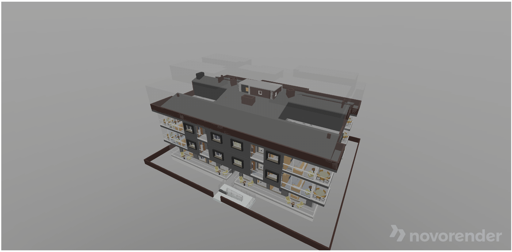

The Novorender Web API includes built-in support for offline usage. The offline module handles local storage, pre-filtering, and synchronization of assets. This not only enables offline functionality but can also greatly enhance the user experience on slow or intermittent internet connections and save bandwidth.

In this guide, we'll explore how to use the offline module to download a scene for offline usage. We will also look at how to incrementally download a scene, if you prefer not to download the full scene in one go.

:::caution Before We Begin
This guide assumes that you have a basic understanding of the Novorender Web API, including setting it up and loading scenes. If you are unfamiliar with these concepts, please check out the resources below first:
- [Getting Started](/docs/tutorial/getting_started)
- [Loading Scenes](/docs/guides/loading_scenes)
:::

### Setting Up and Loading a Scene

We'll start with a basic TypeScript project using Vite. We assume you already have a basic TypeScript project in place with the Novorender Web API installed and ready to go. If you don't have a project yet, please refer to the [following guide](/docs/tutorial/vite_getting_started) to learn how to set up the Novorender Web API in a TypeScript project.

#### Loading the Scene

First, we need to install the Novorender [Data JS API](https://docs.novorender.com/legacy/docs/data-js-api). This API is required to load the scene's metadata. Run the following command to install the package:

```bash npm2yarn
npm install --save @novorender/data-js-api
```

:::tip
Since the [Data JS API](https://docs.novorender.com/legacy/docs/data-js-api) package is a wrapper around Novorender's [REST API](https://docs.novorender.com/legacy/docs/category/data-rest-api-v1), you can directly use the REST API to load scene metadata if you prefer.
:::

To load a scene, use the code below. We'll download this demo scene for offline usage later in this guide.

```typescript title="main.ts"
import { createAPI, type SceneData } from "@novorender/data-js-api";

const serviceUrl = "https://data.novorender.com/api";
const sceneId = "95a89d20dd084d9486e383e131242c4c"; // Default Condos scene ID, which is public.
const dataApi = createAPI({ serviceUrl });

// Load scene metadata
const sceneData = await dataApi.loadScene(sceneId);
...
```

Now, let's render this scene using the Web API:

```typescript title="main.ts"
import { View, getDeviceProfile } from "@novorender/api";
import { createAPI, type SceneData } from "@novorender/data-js-api";

// Get canvas and button references from the HTML document
const canvas = document.getElementById("canvas") as HTMLCanvasElement;

// Assumed GPU tier for a reasonably new/powerful GPU.
const gpuTier = 2;  
const deviceProfile = getDeviceProfile(gpuTier);
const baseUrl = new URL("/novorender/api/", window.location.origin); // or whereever you copied the public/ files from the package.
const serviceUrl = "https://data.novorender.com/api";
const sceneId = "95a89d20dd084d9486e383e131242c4c"; // Default Condos scene ID, which is public.

const imports = await View.downloadImports({ baseUrl });
const view = new View(canvas, deviceProfile, imports);
const dataApi = createAPI({ serviceUrl });
// Load scene metadata
const sceneData = await dataApi.loadScene(sceneId);
const { url: _url } = sceneData as SceneData;
const url = new URL(_url);
const parentSceneId = url.pathname.replaceAll("/", "");
url.pathname = "";

// Load the scene using the URL obtained from `sceneData`
const config = await view.loadScene(url, parentSceneId, "index.json");
const { center, radius } = config.boundingSphere;
// Fit the controller position so the specified bounding sphere is brought into view.
view.activeController.autoFit(center, radius);

// Run the view and clean up resources
await view.run();
view.dispose();
```

Running the above code should result in the scene being loaded in the view, as shown in the image below:



### Downloading the Scene for Offline Usage

Let's proceed with downloading the loaded scene so it can be used offline. There are two ways to download a scene:

1. **Incremental Download**:  
   The Web API gradually downloads parts of the 3D model or scene as needed, rather than all at once, to improve loading times and efficiency.

2. **Full Download/Sync**:  
   The Web API downloads the entire scene in one go, allowing you to use or view it offline without any delay.

To perform incremental syncing, we only need to add (<CodeLink type="class" name="OfflineViewState.addscene"/>) the scene to the <CodeLink type="class" name="OfflineViewState"/>. For a full download, use the <CodeLink type="class" name="OfflineScene.sync"/> method on that scene. To access the view, use <CodeLink type="class" name="view.manageofflinestorage"/>. We'll see all these in action in the rest of the guide.

:::info
Almost all the code you see in this guide is taken from the [Novorender Web App](https://github.com/novorender/novoweb), which is open source and available on GitHub. We encourage you to check out the [offline component code](https://github.com/novorender/novoweb/tree/develop/src/features/offline), which is much more robust and handles many other cases, such as checking for available storage size.
:::

#### Incremental Download

Below is the code required to enable incremental downloading of your scene:

```typescript title="main.ts"
...
// Get button reference from the HTML document
const btnIncrementalDownload = document.getElementById("btnIncrementalDownload") as HTMLButtonElement;
// Get the offline view state context used for offline storage management.
const offlineWorkerState = await view.manageOfflineStorage();

btnIncrementalDownload.onclick = async () => {
    // highlight-next-line
    const scene = await offlineWorkerState.addScene(parentSceneId);

    const sceneData = await dataApi.loadScene(sceneId);
    if ("error" in sceneData) {
        return;
    }

    const persisted = await navigator.storage.persisted();
    if (!persisted) {
        await navigator.storage.persist();
    }

    const meta = localStorage.getItem(parentSceneId);
    const viewerScene = {
        id: sceneId,
        name: sceneData.title,
        lastSynced: new Date().toISOString(),
    };

    const toStore = {
        id: parentSceneId,
        name: parentSceneId,
        lastSynced: meta?.lastSynced ?? "",
        viewerScenes: meta
            ? meta.viewerScenes.find((vs) => vs.id === sceneId)
                ? meta.viewerScenes.map((vs) => (vs.id === sceneId ? viewerScene : vs))
                : meta.viewerScenes.concat(viewerScene)
            : [viewerScene],
    };

    localStorage.setItem(parentSceneId, JSON.stringify(toStore));
};
...
```

#### Full Download/Sync

To enable a full download of a scene, use the <CodeLink type="class" name="OfflineScene.sync"/> function on that scene. The rest of the code will be the same as for incremental download, with the only difference being the call to the `sync` function:

```typescript title="main.ts"
...
// Get button reference from the HTML document
const btnFullDownload = document.getElementById("btnFullDownload") as HTMLButtonElement;
// Get the offline view state context used for offline storage management.
const offlineWorkerState = await view.manageOfflineStorage();

btnFullDownload.onclick = async () => {
    // highlight-next-line
    const scene = await offlineWorkerState.addScene(parentSceneId);

    const sceneData = await dataApi.loadScene(sceneId);
    if ("error" in sceneData) {
        return;
    }

    const persisted = await navigator.storage.persisted();
    if (!persisted) {
        await navigator.storage.persist();
    }

    const meta = localStorage.getItem(parentSceneId);
    const viewerScene = {
        id: sceneId,
        name: sceneData.title,
        lastSynced: new Date().toISOString(),
    };

    const toStore = {
        id: parentSceneId,
        name: parentSceneId,
        lastSynced: meta?.lastSynced ?? "",
        viewerScenes: meta
            ? meta.viewerScenes.find((vs) => vs.id === sceneId)
                ? meta.viewerScenes.map((vs) => (vs.id === sceneId ? viewerScene : vs))
                : meta.viewerScenes.concat(viewerScene)
            : [viewerScene],
    };

    localStorage.setItem(parentSceneId, JSON.stringify(toStore));
    
    // implement a proper `AbortController` in your production code
    const abortController = new AbortController();
    // highlight-next-line
    scene.sync(getSceneIndexUrl(view), abortController.signal);
};
...
```

### Deleting Offline Scenes

You can use the <CodeLink type="class" name="OfflineScene.delete"/> function to delete a single scene or use <CodeLink type="class" name="OfflineViewState.deleteall"/> to delete all offline data and remove every offline scene.

### Logging

To see logs or progress while downloading, you must assign a custom object that implements the <CodeLink type="interface" name="Logger"/> interface to the <CodeLink type="class" name="OfflineScene.logger"/> property. 

Here’s how to create a simple logger function and assign it to the scene's `logger` property:

```typescript title="logger.ts"
import { OfflineErrorCode } from "@novorender/api";

export const createLogger = (parentSceneId: string): OfflineViewState["logger"] => {
    return {
        status: (status) => {
            console.log(status);
        },
        error: (error) => {
            console.error(error);
            if (error.id === OfflineErrorCode.quotaExceeded) {
                alert("Not enough disk drive space on the device.");
                console.log({ scene: parentSceneId, status: "error" });
            }
        },
        progress: (current, max, operation) => {
            console.log(current, max, operation);
        },
    };
};
```

Then, assign this logger to the scene like this:

```typescript title="main.ts"
...
await offlineWorkerState?.addScene(parentSceneId);
// highlight-next-line
scene.logger = createLogger(parentSceneId);
scene.sync(getSceneIndexUrl(view), abortController.signal);
...
```

The `logger` implementation can do more than just logging to the console, such as updating the UI or showing alerts. You can check out Novoweb's logger implementation [here](https://github.com/novorender/novoweb/blob/develop/src/features/offline/useHandleOffline.ts#L359) or see the documentation for more details on the <CodeLink type="interface" name="Logger"/> interface.

### Source Code

The full source code for this example is available [here](https://github.com/novorender/novorender-examples/tree/master/offline-demo-app) on GitHub. You can run it locally by following the instructions in the README file. The app also includes some elements not covered in this guide, so be sure to check it out.

You can also run the application directly in your browser by clicking the button below:

[](https://stackblitz.com/github/novorender/novorender-examples/tree/master/offline-demo-app?file=src/main.ts)

### A Word About Service Workers

While the Novorender Web API handles the offline aspects of your scenes, other parts of your application may still require an active internet connection. It is recommended to add a service worker to your application to make it fully offline-capable.