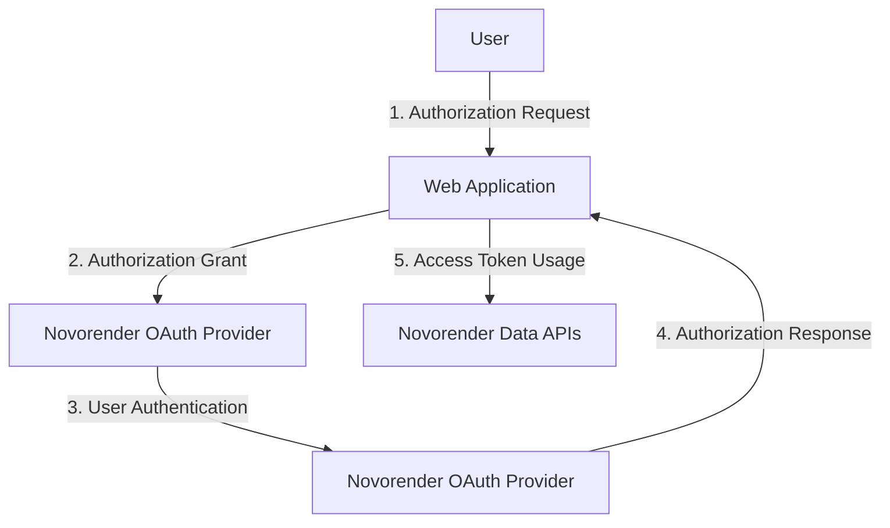

# Using Novorender OAuth in Your Projects

[OAuth (Open Authorization)](https://en.wikipedia.org/wiki/OAuth) is an open standard for access delegation, commonly used as a way for Internet users to grant websites or applications access to their information on other websites without sharing their passwords. In a web project, OAuth can be implemented to enable secure and seamless authentication and authorization processes.

## What is OAuth?

OAuth allows users to grant third-party access to their resources on one website without sharing their credentials. It provides a secure and standard way for applications to authenticate and authorize users. OAuth operates over HTTPS and uses access tokens instead of sharing passwords.

## How OAuth Works

1. **Authorization Request**: The user initiates the OAuth process by clicking on a button or link to sign in with a third-party (Novorender in our case) service.

2. **Authorization Grant**: The application sends an authorization request to the OAuth provider (Novorender), including its client credentials and the scope of access requested.

3. **User Authentication**: The user is redirected to the OAuth provider's authentication page, where they log in and authorize the application's access to their resources.

4. **Authorization Response**: Once the user grants access, the OAuth provider (Novorender) sends an authorization code or access token back to the application.

5. **Access Token Usage**: The application uses the access token to make authorized requests on behalf of the user to the Novorender Data APIs.

Novorender OAuth uses PKCE (Proof Key for Code Exchange) ([RFC 7636](https://www.rfc-editor.org/rfc/rfc7636)) which is a security extension for OAuth 2.0 designed to prevent authorization code interception attacks. It involves additional steps in the OAuth flow to generate and verify a code challenge.
- **Create Code Verifier**: The web application generates a random string called the code verifier.
- **Hash Code Verifier**: The code verifier is hashed using a cryptographic hash function (e.g., SHA-256).
- **Send Code Challenge**: The web application includes the hashed code verifier as the code challenge in the authorization request.
- **Validate Code Challenge**: The OAuth provider validates the code challenge to ensure that the authorization request originated from the same client that initiated the authorization code flow.

These additional steps enhance the security of the OAuth flow by ensuring that authorization codes can only be exchanged by the intended client.

## Prerequisite
Make sure your application is already registered with Novorender and you have the correct credentials (Client Id and Client Secret), If you're not sure, just ask Novorender support for help.

You'll also need to provide a `redirect_uri`, The `redirect_uri` parameter specifies where the OAuth provider redirects the user after authentication. It must match a registered URI to prevent attacks and ensure secure authentication.

## Implementing OAuth in Your Web Project
We've made a basic TypeScript project using [Vite](https://vitejs.dev/guide/) to help you start with Novorender OAuth in your projects. Just clone [this repo](https://github.com/novorender/novorender-examples) and go to the `/oauth` folder. Follow the steps in the `readme.md` file to begin.

The project implements the Novorender OAuth in a simple application by following the same steps as described [previously](#how-oauth-works).

In the project, the main code is in the `/src` folder. The entry file is `/src/main.ts`. You'll find the OAuth stuff in `/src/oauth.ts`, and the important helper functions for PKCE are in `src/utils.ts`.

Although the code is easy to understand, make sure to go through it carefully and tweak it to fit your project needs. Feel free to explore and adjust the code to make it work for you!

:::note[OAuth doesn't fit your needs?]

If OAuth doesn't meet your requirements or you prefer not to add another login layer, you can use API keys with Novorender Data APIs instead. Just reach out to Support, and they'll provide you with one.
:::