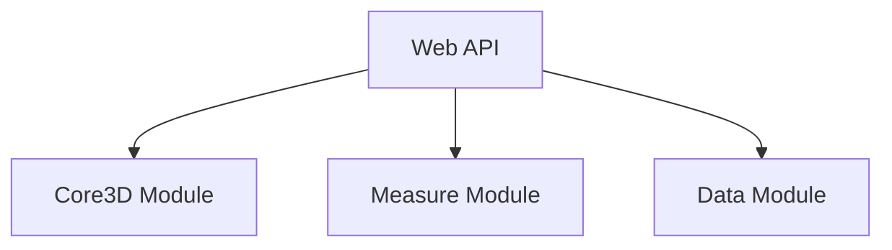

<PackageHeader />

The novorender API consist of several modules.

### Core3D Module
Core3D Module is optimized to deliver scalable 3D rendering capabilities.
### Measure Module
This module contains standard measure functions for Novorender data models.
### Data Module
Data Module provides APIs for managing scalable 3D rendering in the cloud.

## Getting started

<ActionCard cards={[
  {title:"Quick Start", description:"Read our quick start tutorial to learn how to setup a basic application using Novorender Web API.", actionLabel:"Read", link:"/docs/tutorial/getting_started"},
  {title:"Documentation", description:"Refer to the reference documentation for detailed information on different methods and classes.", actionLabel:"Go to Docs", link:"/docs/web_api/API"},
  {title:"Interactive Guides", description:"Take a look at our interactive guides, which provide in-depth insights into various features.", actionLabel:"Check out Guides", link:"/docs/category/guides"}
  ]} />

export const PackageHeader = () => (
    

      
Novorender Web API

      <PackageVersion />
    

);

export const PackageVersion = () => (
    
Build version: {WEB_API_VERSION}

);

