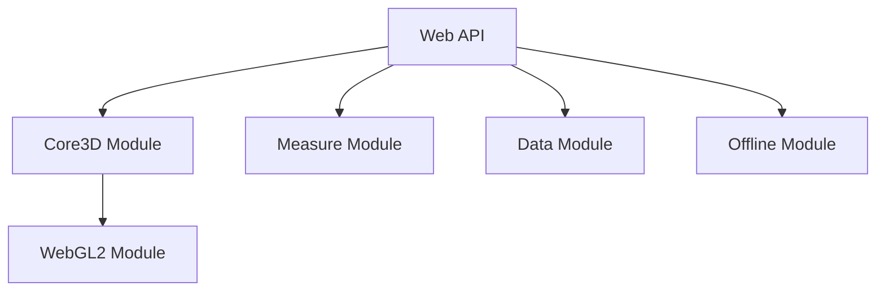

<PackageHeader />

The novorender Web API consist of several modules.

### Core3D Module

The Core3D module handles 3D rendering on the browser platform.
Streaming geometry from the cloud enables very large scenes to be rendered even on modest mobile devices.

### Measure Module

This module enables various forms of measurements and visualization of such.
By using the original parametric CAD/BIM data whenever available, it produces accurate and reliable measurements.

### Data Module

The data module handles authentication and meta-data.
Employing a custom made search engine, it provides fast and complex queries on meta-data properties keys and values.

### Offline Module

The offline module handles local storage, pre-filtering and synchronization of assets.
Not only does this enable offline use, but can also greatly enhance the experience for slow and/or intermittent internet connections.

### WebGL2 Module

Provides a thin, yet powerful typescript wrapper on top of the WebGL2 API.

## Getting started

<ActionCard cards={[
  {title:"Quick Start", description:"Read our quick start tutorial to learn how to setup a basic application using Novorender Web API.", actionLabel:"Read", link:"/docs/web_api/tutorial/getting_started"},
  {title:"Documentation", description:"Refer to the reference documentation for detailed information on different methods and classes.", actionLabel:"Go to Docs", link:"/docs/web_api/api_reference"},
  {title:"Interactive Guides", description:"Take a look at our interactive guides, which provide in-depth insights into various features.", actionLabel:"Check out Guides", link:"/docs/category/guides"}
  ]} />

export const PackageVersion = () => (
  
Build version: {WEB_API_VERSION}

);

export const PackageHeader = () => (
  

    
Novorender Web API

    <PackageVersion />
  

);

